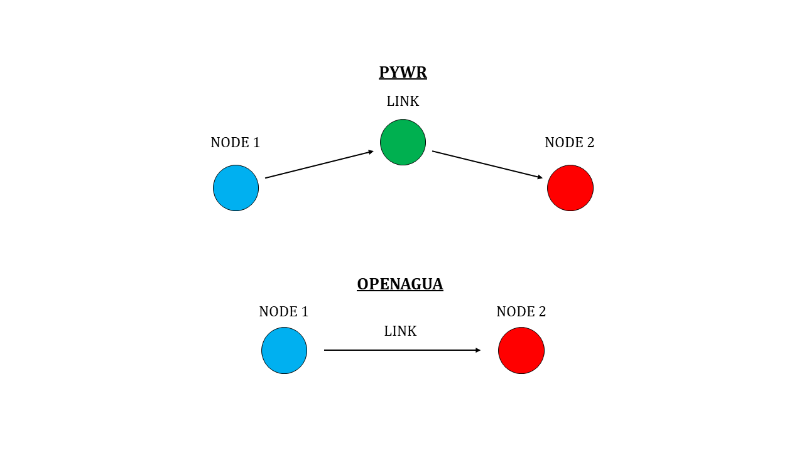

# Overview
Pywr - CDMX is a water resources allocation model that solves for water delivery during supply shortages with the City of Mexico (CDMX) potable water distribution system (as modeled in OpenAgua). It uses linear programming to maximize the benefits of water delivered at each time step and is intended to serve as a computationally faster substitute for the Pyomo LP model currently used in OpenAgua (OA). A generalized code written in Pywr for all OA based networks is under development.

## Getting Started
Pywr’s [documentation](https://pywr.github.io/pywr-docs/index.html) and [project folder](https://github.com/pywr/pywr) may be found on GitHub. Step by step [installation instructions](https://pywr.github.io/pywr-docs/install.html) are also available. It is recommended that windows users install via Anaconda as described under “Installing binary packages with Anaconda.” First time Anaconda users may refer to the [conda documentation](https://conda.io/docs/user-guide/getting-started.html) for more information. Note that a linear programming solver must be installed on the user’s computer (e.g. [GLPK](http://winglpk.sourceforge.net/)) to run Pywr models.

## CDMX OpenAgua Network
The CDMX distribution network, as modeled in OA, was collaboratively developed by members of the Hydrosystems Group at UMass and researchers from the University of Cincinnati. The network is comprised of several surface water and groundwater inflows, a set of dispersed demands representing localized human consumption by delegación, storage tanks, water conveyance infrastructure, and other system features designed to constrain flow capacities within the network (e.g. lifting stations and pumping plants). Distribution system hydraulics are currently ignored.

## Integrating with OpenAgua
Pywr - CDMX depends on a json formatted network data file extracted from OA. A number of user-defined project level routines are required to access the correct data for unique model runs, including the json data filename, the scenario/option combination desired, and resource types utilized in OA. Further development should focus on replacing these with call routines excluded from the model script and developing a direct link between OA network data and the Pywr model. Relevant topological information (spatial relationships amongst network components) for network links and nodes is extracted from the network-specific json file and used to generate a Pywr replica of the original OA network.

## General Pywr Information
Pywr nodes within the CDMX model are subdivided into either an Input, Output, Storage, or Link. Other classes and subclasses of nodes are available for use within Pywr. In summary:
*	 Input nodes add flow to the network and represent sources of supply (e.g. surface waters, groundwater, etc.)
*	Output nodes remove flow from the network and may represent system demands or evaporative losses
*	Storage nodes provide temporary placement for water and may include storage tanks or reservoirs
*	Link nodes are used to model connections between network components (e.g. pipelines and aqueducts)

Pywr requires the node classification for a link in order to alter various constraints. This conceptual difference is illustrated below:

### Important Considerations
*	All possible routes within the OA network must begin with an Input node and end with an Output node
*	Any rogue nodes (i.e. a node without any connections) from the OA network are automatically removed from the Pywr routine
*	Nodes of the “Storage” class must have their connections to and from other nodes explicitly defined (as accounted for in the code)
